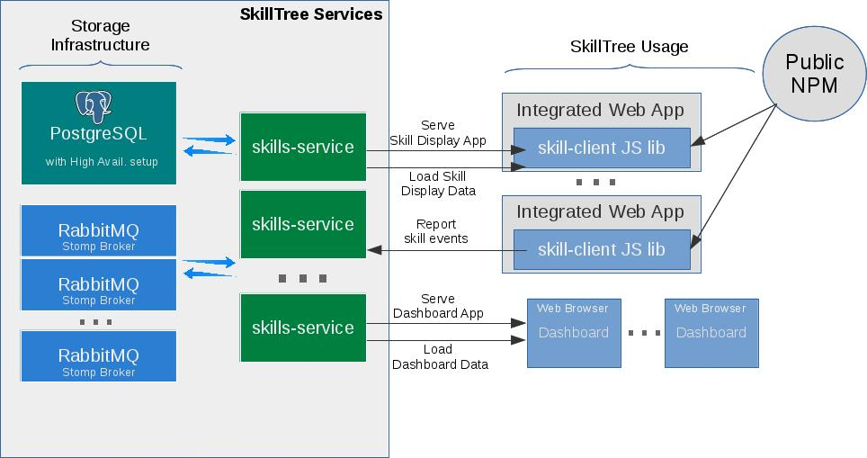

# Architecture

This section will dive into how the code is arranged and how that code relates to the deployed daemons and artifacts. 
Before you read this section please make sure that you made yourself familiar with the [Install Guide](/dashboard/install-guide/), the
[Dashboard User Guide](/dashboard/user-guide/) and the [Integration Guide](/skills-client/#client-display-integration).

SkillTree's skills-service is designed with minimal runtime requirements. 
You can start SkillTree skills-service with zero configuration and it will use in-memory [H2 database](https://www.h2database.com). 
Please visit the [Install Guide](/dashboard/install-guide/) to better understand your installation options. 

Let's now focus on what the production deployment would look like. Production installation of the skills-service will require the following infrastructure: 
- [PostgreSQL](https://www.postgresql.org/) - Relational store for the project definitions and the skill events. 
- [RabitMQ Stomp Brokers](https://www.rabbitmq.com/stomp.html) - Used to support [WebSocket](https://en.wikipedia.org/wiki/WebSocket) functionality. 

SkillTree's skills-service is then configured to use PostgeSQL and Stomp Brokers.

 

Integrated clients utilize skill-client libs (Vue.js, react, etc..) posted on the public NPM repositories. 
These libraries are very thin wrappers around an iFrame tag, they simply retrieve Skills Display app and its associated data from the skills-service.
What that means is that Skills Display is served as its own web-based application from the skills-service and then inserted into an iFrame tag on the client's browser. 
Of course all of these details are 100% hidden from the skills-client libraries' users. 
skills-service also serves dashboard as a separate application and that is what returned by default when users arrives to the "/" url.

Skills-client libraries also enable integrators to report skill events. 
Skill reporting utilities will call [Report Skill Event Endpoint](/skills-client/endpoints.html#report-skill-event-endpoint) which is exposed via skills-service.     
SkillTree integrators can also call [Report Skill Event Endpoint](/skills-client/endpoints.html#report-skill-event-endpoint) directly. 
Using skill-client libraries users can register for global events so they can be notified any time a skill event is reported. 
An event is fed the [result object](/skills-client/endpoints.html#endpoint-result-object) that contains metadata about the event and the achievements that this event may have caused.
This is where WebSocket integration is critical. 
External clients may report skill events directly via [Report Skill Event Endpoint](/skills-client/endpoints.html#report-skill-event-endpoint) 
so WebSockets are utilized to propagate the outcome of that event to all the registered clients.      

## SkillTree Repositories

1. skills-service: has code for the skills service, dashboard and client display, this is where the majority of code changes occur 
1. skills-client: client JS libraries that provide skill event reporting utilities and a thin iFrame-based wrapper for the client display. 
1. skills-docs: documentation, you are reading this now!
1. skills-stress-test: web-based application that facilitates stress tests against skills-service.
1. call-stack-profiler-core: Groovy annotation-driven in-code profiling utility used by the services. 

    
