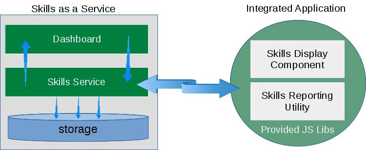

# Overview

The dashboard is a web-based user interface that enables creation and management of an applications' training profile. 
It also provides corporate visibility of application expertise and offers metrics and various visualizations.  
The dashboard is used by application administrators/integrators as well as supervisors. 
 

If your organization is running the Skills as a Service platform, then you will be provided with its URL to get started. 
If you are installing the Skills as a Service platform from scratch (see [Install Guide](/dashboard/install-guide/)) then... well you just know where it's running. 
   
## Building Training Profile

If you are integrating gamification training into your application you will first need to build a training profile. 
The first step is to create a brand new project. 
Projects are composed of Subjects which are made of Skills and a single skill defines a training unit within the gamification framework. 

Consider the following items when designing your training profile:

1. [Subjects](/dashboard/user-guide/subjects.html): Subjects are a way to group and organize skill definitions. They provide a theme for a group of skills and can have their own specific achievement levels.
   - Do your best to create subjects in multiples of 3. On a larger screen, the Skills Display renders up-to 3 subjects per row so 3, 6, 9, 12, etc., will look the best. 
   - Design subjects to encourage your users to be able to achieve sub-specializations within your application. Subjects implement a [levels model](/dashboard/user-guide/levels.html) so users are awarded subject level achievements.
1. [Skills](/dashboard/user-guide/skills.html): A Skill defines a single training unit within the gamification framework.
   - To complete a skill, users may need to perform the same action multiple times - repetition is important for retention after all. Each occurrence is called a Skill Event.
   - Description is optional and can be used to document training steps or additional references or information related to the skill. 
   - Help URL can be used to point to additional resources.  
1. [Levels](/dashboard/user-guide/levels.html): Levels are users' achievement path - the overall goal of the training profile is to encourage users to achieve the highest level. 
   - Levels are tracked for the entire project as well as for each subject which provides users many ways to progress forward, as well as frequent positive reinforcement opportunities.
   - The Skills dashboard supports two ways to manage levels: Percentage Based (default) and Point based. If you are not sure which to go with stick with the default.    
1. [Badges](/dashboard/user-guide/badges.html): Badges add another facet to the overall gamification training profile and allow you to further reward your users by providing these prestigious symbols of achievement. 
   - Badges are a collection of skills and when all of the skills are completed that badge is awarded.
1. [Global Badges](/dashboard/user-guide/badges.html#global-badges): Global Badges are a special kind of badge that is made up of a collection of skills and/or levels that span across project boundaries.
1. [Dependencies](/dashboard/user-guide/dependencies.html): Dependencies add another facet to the overall gamification training profile, which forces users to complete skills in a specified order.
1. [Cross-Project Dependencies](/dashboard/user-guide/dependencies.html#cross-project-dependencies): Cross-Project Dependencies facilitate cross-application training and enable users to become domain experts across several applications. 
   - These dependencies are critical when actions are required to be performed in more than one tool in order to complete a task.

::: tip
Consider creating skills that won't be reported automatically but rather will require users to contact the application owner who will then 
[Manually add the Skill](/dashboard/user-guide/skills.html#manually-add-skill-event). Why would you do that? If you want to encourage
customer interaction such as collecting success stories. In fact ``Report A Success Story`` can be a skill of its own!
:::

## Browser Support

Skills as a Service is supported on all major browsers since the following versions:

<browser-support />
