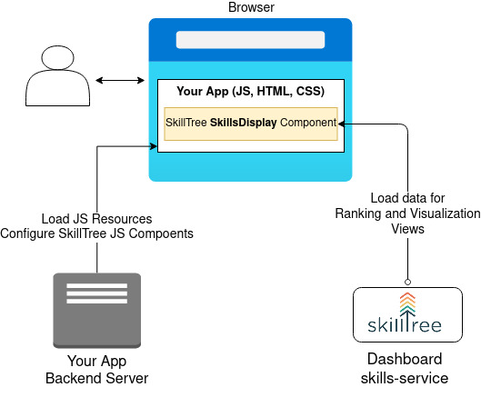
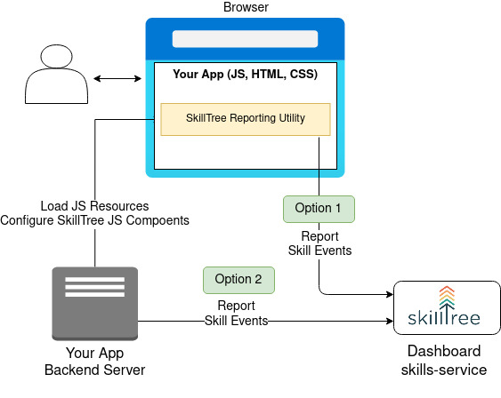

# Overview

In order to support rapid integration SkillTree has taken an innovative approach of supplying fully navigable **Ranking and Visualization** views.
User's progress and ranking is visualized using a JS [Skills Display](/skills-client/#skills-display-integration) component that comes with the provided 
[SkillTree Client Libraries](/skills-client/#skilltree-client-libraries). These libraries also enable instrumenting your application to report skill events 
via the JS skill reporting utility.  

 

::: tip Please Note
In order to support rapid integration SkillTree does **not** expose an API to retrieve individual gamification training profile components such as skills, subjects, badges, etc... but rather
provides fully navigable and themeable **Ranking and Visualization views** that implement display of those concepts.
:::

To integrate with the SkillTree service/dashboard please execute the following steps:

1. Create and customize your training profile in the [SkillTree dashboard](/dashboard/user-guide/)
1. Embed **Ranking and Visualization** views using the [Skill Display](/skills-client/#skills-display-integration) component
1. Instrument your application to report [skill events](/skills-client/#report-events-integration) 
   - Use the SkillTree [Reporting JS Utility](/skills-client/#report-events-integration) and/or [REST endpoints](/skills-client/endpoints.html)
   - IDs for the skill events reported must match the training profile created in step 1.

   
Please visit the [Dashboard Guide](/dashboard/user-guide/) to learn about the best practices and options for customizing your gamification training profile.
This Integration Guide focuses on step 2 and 3: integration of the Client Display and the reporting libraries. 

## SkillTree Client Libraries

SkillTree Client JS libraries are used to integrate gamified training into your web-application. 
These libraries are hosted on [NpmJs.com](https://www.npmjs.com/search?q=%40skilltree) so they can be easily installed.  

SkillTree client libraries support: 
- Fully navigable **Ranking and Visualization** views via the [Skill Display](/skills-client/#skills-display-integration) component
- [SkillsReporter](/skills-client/#report-events-integration) JS utility to report skill events
- A convenient component to display user's current overall level in the application.
- Global event handler JS functions that allows applications to register for all skill events
  - Ex. in order to display encouragements for things like points earned and levels completed 

There are several libraries supported, please visit the following links to learn more: 
- [Vue.js](/skills-client/vuejs.html)
- [React](/skills-client/react.html)
- [Angular](/skills-client/angular.html)
- [Pure JS](/skills-client/js.html)

## Skills Display Integration 

The Skills Display component provides fully navigable and themeable **Ranking and Visualization** views.
This UI component is integrated into your web-based application by utilizing SkillTree libraries which are hosted on [NpmJs.com](https://www.npmjs.com/search?q=%40skilltree) so they can be easily installed.

Below is a screenshot of the component's landing view: 

Rank, Badges and Subject cards are clickable and allow users to drill down to those views.
Please visit the [Screenshots](/overview/#ranking-and-progress-display) section to see more examples of the Skills Display component.

::: tip
You can easily theme this component to match your application's look-and-feel.
:::

Skills Display visualizes gamified training progress and ranking for a user, which includes subjects, skills, badges and dependencies just to mention a few. 

::: tip Please Note
In order to support rapid integration SkillTree does **not** expose an API to retrieve specific gamification training profile components such as skills, subjects, badges, etc... but rather
provides fully navigable **Ranking and Visualization views** that implement display of those concepts.
:::

When integrating the Skills Display component into your application we generally recommend the following integration pattern:

1. Put a button in the header that displays the user's level (ex. ``Level 1``)
   - We like placement on the top right but this really depends on your layout
1. Clicking on the button will take you to the page that renders the Skills Display
   - Use one of the provided client libraries if using an explicitly supported UI framework or the Pure JS client library if using a different UI framework
   - Dedicate a full page to the Skills Display    
1. (Optional) Theme Skills Display to match your application   
1. (Optional) Display user progress summary on your home page or splash page
   - Pass ``true`` to skills display ``options.isSummaryOnly``

Skills Display support is provided for the following libraries, please navigate to a specific library to learn more: 
- [Vue.js](/skills-client/vuejs.html)
- [React](/skills-client/react.html)
- [Angular](/skills-client/angular.html)
- [Pure JS](/skills-client/js.html)

## Report Events Integration

When reporting skill events you have 2 options: 
- Option 1: Directly from JS code - SkillTree libraries come with a SkillsReporter JS utility that enables you to report skill events.
- Option 2: From the backend server using SkillTree REST endpoints

::: tip
Generally option 1 is the most common use-case but sometimes it's easier to derive skill events on the backned server.  
:::

Please visit the following sections to learn more:
- [Vue.js](/skills-client/vuejs.html)
- [React](/skills-client/react.html)
- [Angular](/skills-client/angular.html)
- [Pure JS](/skills-client/js.html)
- [REST Endpoints](/skills-client/endpoints.html#programmatic-endpoints)

## Browser Support

SkillTree is supported on all major browsers since the following versions:

<browser-support />
